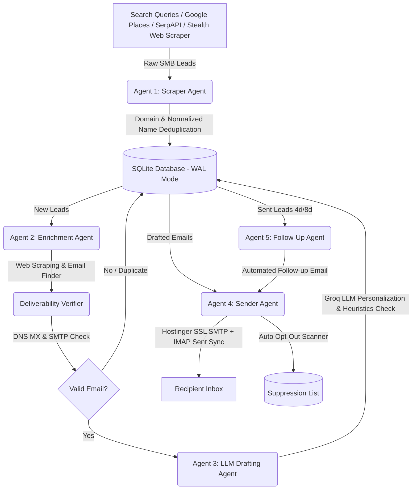

# 🚀 Autonomous Multi-Agent B2B Lead Generation & Outreach System

[](https://www.python.org/)
[](https://groq.com/)
[](https://www.sqlite.org/)
[](LICENSE)

An enterprise-grade, 24/7 autonomous multi-agent system designed for targeted Small-to-Medium Business (SMB) lead discovery, website enrichment, deliverability-safe email verification, LLM personalization, and multi-stage cold outreach.

Built with **Zero Hard Selling** in mind — focusing strictly on soft, curiosity-driven operational questions to book high-converting discovery calls.

---

## 🏛️ System Architecture



---

## ✨ Key Features

### 🤖 1. Multi-Agent Architecture (`APScheduler`)
- **Agent 1: Lead Scraper**: Multi-source fallback pipeline querying Google Places API (New & Legacy), SerpAPI Google Maps, DuckDuckGo stealth scraper, and CSV lead importers.
- **Agent 2: Enrichment Agent**: HTML scraper extracting company summaries, operational pain points, and contact emails directly from website DOM trees. Includes HTTP connection pooling and a **2MB stream byte cap** to prevent memory bloat.
- **Agent 3: Email Drafting Agent**: Uses **Groq LLM API (`groq/compound-mini`)** to craft casual, high-converting cold emails (<60 words) targeting 10-minute discovery chats. Includes automated heuristic checks for tone, spam phrases, and signature validation.
- **Agent 4: Sender Agent**: Authenticated Hostinger SSL SMTP transmitter. Syncs sent emails to Hostinger Webmail `Sent` folder via IMAP (`mail.append()`) and scans inbox for automated `STOP` / `UNSUBSCRIBE` opt-out processing.
- **Agent 5: Follow-Up Manager**: Manages automated 4-day and 8-day follow-up sequences before closing non-responsive leads cleanly.

### 🛡️ 2. Enterprise Deliverability & Reputation Protection
- **Daily Send Cap**: Hard-capped at **20 emails/day** per sender domain to guarantee top-tier inbox placement.
- **Random Delay Jitter**: Paces sends with **60 to 180-second randomized delays** between messages to mimic human behavior.
- **Business Hours Scoping**: Enforces strict sending windows (e.g. 9:00 AM – 6:00 PM IST, Mon–Fri).
- **Multi-Stage Email Verification**: 4-level verifier validating syntax, disposable domains, DNS MX records, and SMTP port 25 handshakes.

### ⚡ 3. High Performance & Strict Deduplication
- **SQLite Write-Ahead Logging (WAL)**: Configured with `PRAGMA journal_mode = WAL;`, `synchronous = NORMAL;`, `busy_timeout = 30000;`, and 64MB RAM caching for zero DB lock contention.
- **Normalized Company Name Stripping**: Cleans legal suffixes (`LLC`, `Inc`, `Corp`, `Ltd`, `Pvt Ltd`, etc.) and punctuation to catch duplicates across varied search listings.
- **Email Deduplication**: Prevents duplicate outreach to the same recipient across active leads and suppression lists.

### 📊 4. Real-time CLI Dashboard & Health Monitoring
- Includes `status_report.py` for real-time lead counts, status percentage breakdowns, completed agent batch logs, and active log tailing.
- Includes a lightweight HTTP Health Check server thread on port `10000` for 24/7 Render Web Service & UptimeRobot integration.

---

## 🛠️ Technology Stack

- **Core**: Python 3.11+
- **LLM Engine**: Groq API (`groq/compound-mini` / `llama-3.3-70b-versatile`)
- **Orchestration**: `APScheduler` (Cron & Interval Triggers)
- **Scraping & HTML Parsing**: `BeautifulSoup4`, `lxml`, `requests` with connection pooling
- **Email & Deliverability**: `smtplib`, `imaplib`, `dnspython`
- **Database**: SQLite3 (WAL Mode & Custom Indexes)

---

## 🚀 Quick Start & Installation

### 1. Clone the Repository
```bash
git clone https://github.com/manish182003/lead_and_email_automation.git
cd lead_and_email_automation
```

### 2. Set Up Virtual Environment
```bash
python3 -m venv venv
source venv/bin/activate  # On Windows: venv\Scripts\activate
pip install -r requirements.txt
```

### 3. Configure Environment Variables
Copy `.env.example` to `.env` and fill in your credentials:
```bash
cp .env.example .env
```

Example `.env`:
```env
# LLM Credentials
GROQ_API_KEY=gsk_your_groq_api_key_here

# Lead Scraping Credentials
SERPAPI_KEY=your_serpapi_key_here
GOOGLE_PLACES_API_KEY=your_google_places_api_key_here

# Email SMTP Credentials (Hostinger)
SMTP_HOST=smtp.hostinger.com
SMTP_PORT=465
SMTP_USER=hello@outreach.bloobeach.com
SMTP_PASS=your_email_password_here

# Sender Profile
SENDER_NAME=Jefferson Geerman
SENDER_EMAIL=hello@outreach.bloobeach.com
PORTFOLIO_WEBSITE=https://bloobeach.com
```

---

## 💻 Usage

### Run Real-Time CLI Status Dashboard
```bash
python status_report.py
```

### Run Single-Pass Test Execution
```bash
python orchestrator.py --run-once
```

### Run 24/7 Background Multi-Agent Scheduler
```bash
python orchestrator.py
```

---

## ☁️ Deployment

- **Render Free Web Service**: Includes pre-configured `render.yaml` Blueprint. Combine with [UptimeRobot](https://uptimerobot.com) pinging your app URL every 5 minutes to run 24/7 for $0.
- **Oracle Cloud / Linux VPS**: Includes automated 1-click deployment script `deploy.sh` configuring Linux `systemd` background service (`email-automation.service`) with auto-restart on boot.

---

## 📄 License

Distributed under the MIT License. See `LICENSE` for details.

Developed by **Jefferson Geerman** / **Manish Joshi** ([bloobeach.com](https://bloobeach.com) | [manishjoshi.online](https://manishjoshi.online)).
